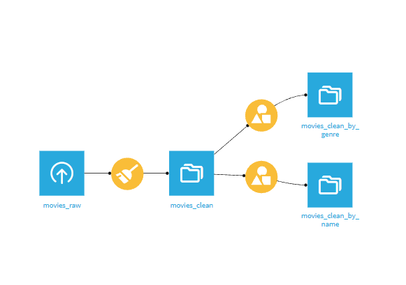
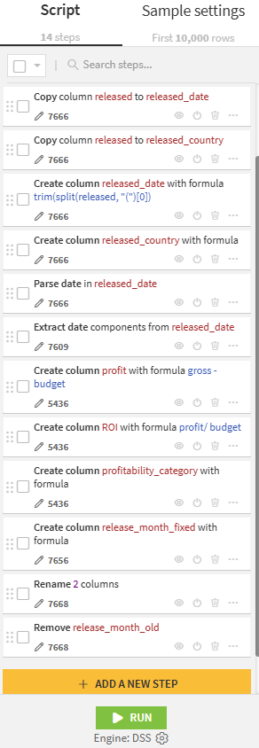
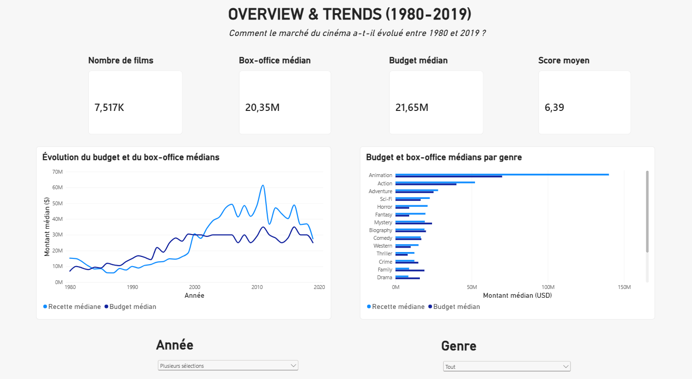
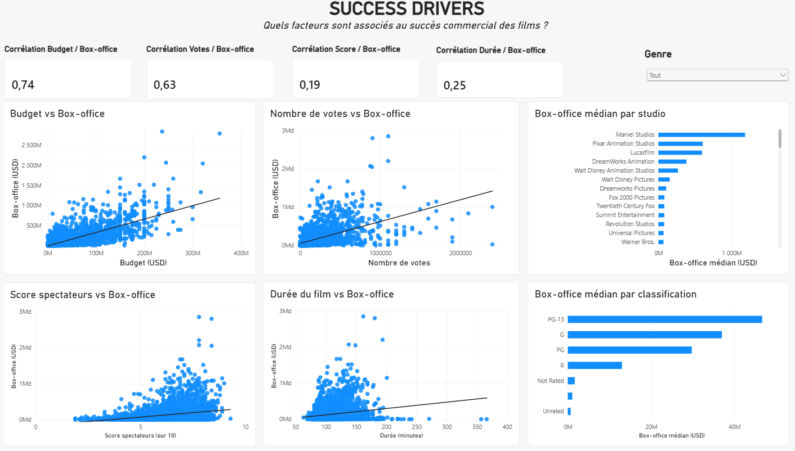
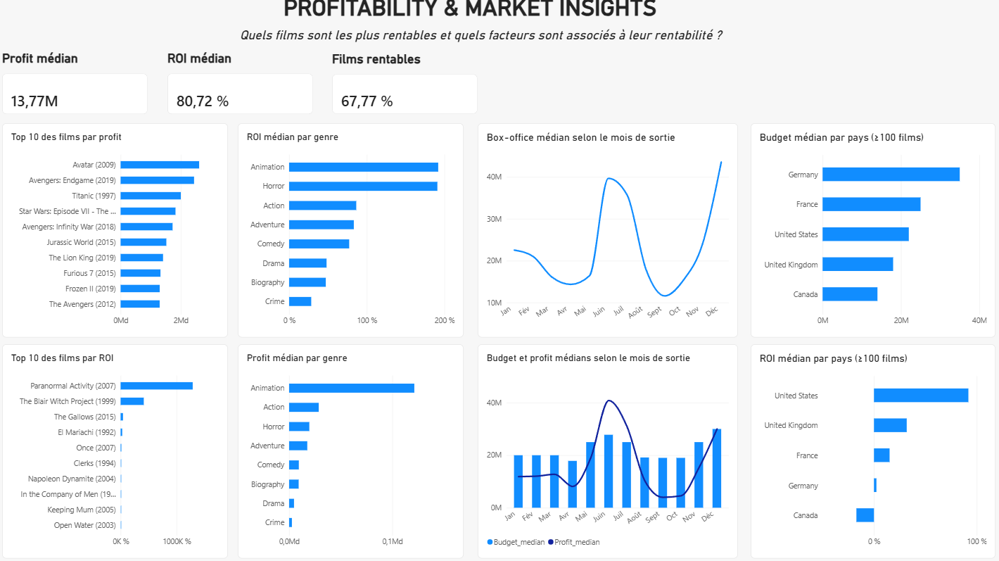

# Movie Industry Analytics — Dataiku & Power BI

Personal data analysis project exploring the factors associated with movie commercial performance.

**Tools:** Dataiku | Power BI | DAX  
**Methods:** Data Cleaning | Data Quality | KPI Analysis | Median Analysis | Pearson Correlation | Data Visualization

---

## 1. Project Overview

Movie success depends on many factors: budget, genre, release strategy, marketing, distribution, franchises or audience interest.

This project focuses on the factors that can be measured with the available data.

The analysis addresses the following questions:

- Which genres generate the highest box-office revenue?
- Is a higher budget associated with higher revenue?
- Are audience scores associated with commercial success?
- Is the number of votes associated with box-office performance?
- Is movie runtime associated with revenue?
- Which production companies show the highest median revenue?
- Which movies generate the highest profit and ROI?
- Is profitability different across genres?
- Is release month associated with commercial performance?
- How have budgets and revenues evolved over time?
- Are there differences in budget and profitability across countries?

The objective is to identify patterns and associations, not causal relationships.

---

## 2. Dataset

The project uses the public **Movie Industry** dataset available on Kaggle.

The original dataset contains:

- **7,668 movies**
- **15 variables**
- Movies released between **1980 and 2020**

Available information includes movie title, genre, release information, budget, gross revenue, audience score, number of votes, director, writer, main actor, production company, country and runtime.

The raw dataset contains missing values and variables that require cleaning and transformation before analysis.

---

## 3. Data Preparation with Dataiku

Data preparation and quality checks were performed in **Dataiku**.

The goal was to produce a clean and structured dataset for the Power BI analysis.

### 3.1 Data Quality

The main checks included:

- Analyzed missing values.
- Checked duplicate records.
- Validated data types.
- Checked data consistency.
- Inspected financial variables and extreme values.

No duplicate movie was identified using the combination of **title, year and director**.

Budget is the main incomplete financial variable, with approximately **28% missing values**.

Missing budgets were not imputed. This avoids introducing estimated values into the profitability analysis.

### 3.2 Data Transformation

The main transformations included:

- Converted `votes` from decimal to integer.
- Separated information contained in the original `released` field.
- Created `released_date`.
- Extracted `released_country`.
- Extracted `release_month` for seasonality analysis.
- Created `profit`.
- Created `ROI`.
- Created profitability categories.

Profit was calculated as:

`Profit = Gross Revenue - Budget`

ROI was calculated as:

`ROI = Profit / Budget`

**Profit** measures the absolute financial gain of a movie.

**ROI** measures the return relative to its production budget.

### 3.3 Dataiku Flow

The final Flow combines the preparation, quality checks and analytical steps.

### 3.4 Prepare Recipe

The Prepare recipe contains the main cleaning and transformation operations applied to the raw dataset.

The final dataset contains **7,668 rows and 21 variables**.

It was then exported to Power BI.

---

## 4. Analysis and Visualization with Power BI

The cleaned dataset was imported into **Power BI** for analysis and visualization.

DAX measures and calculated columns were created for:

- Number of movies
- Median box-office revenue
- Median budget
- Median profit
- Median ROI
- Percentage of profitable movies
- Average audience score
- Correlation indicators

Median values were mainly used for financial analysis.

Budgets, revenues and profits contain large differences between small productions and major blockbusters. The median reduces the influence of these extreme values.

The dashboard contains three pages.

### 4.1 Overview & Trends

The first page provides an overview of the movie market between **1980 and 2019**.

It covers:

- Main KPIs
- Evolution of median box-office revenue
- Evolution of median production budget
- Budget and revenue by genre
- Year and genre filtering

Both median budgets and revenues increase over the period covered by the dataset.

Clear differences also appear between genres.

The year **2020 was excluded from the time analysis** because the dataset contains only a small and incomplete sample for that year.

Financial values are not adjusted for inflation. Long-term financial trends should therefore be interpreted carefully.

---

### 4.2 Success Drivers

The second page explores the variables associated with box-office revenue.

Four relationships were tested:

- Budget vs. box-office revenue
- Number of votes vs. box-office revenue
- Audience score vs. box-office revenue
- Runtime vs. box-office revenue

Scatter plots and linear trend lines were used to visualize these relationships.

The **Pearson correlation coefficient** was calculated to measure their linear strength.

Pearson's coefficient ranges from **-1 to +1**:

- Close to **+1**: strong positive relationship
- Close to **0**: weak linear relationship
- Close to **-1**: strong negative relationship

| Relationship | Pearson correlation |
|---|---:|
| Budget / Box-office | **0.74** |
| Votes / Box-office | **0.63** |
| Runtime / Box-office | **0.25** |
| Audience Score / Box-office | **0.19** |

**Budget has the strongest association with box-office revenue (r = 0.74).** Higher-budget movies tend to generate higher revenues in this dataset.

**Number of votes also shows a clear positive association (r = 0.63).** However, votes can also reflect the visibility and popularity generated by a successful movie.

**Audience score shows a weak association with revenue (r = 0.19).** A highly rated movie is not necessarily a major commercial success.

**Runtime also shows a weak association with revenue (r = 0.25).** Movie duration alone is therefore not strongly related to box-office performance.

Median revenue was also compared across production companies and movie ratings.

---

### 4.3 Profitability & Market Insights

The third page focuses on **profitability rather than revenue alone**.

Main indicators:

- **Median profit: $13.77M**
- **Median ROI: 80.72%**
- **Profitable movies: 67.77%**

Around two thirds of movies with sufficient financial data generated a positive profit.

Profit and ROI provide two different views of performance.

**Profit** identifies movies with the largest absolute financial gains.

**ROI** identifies movies with the largest return relative to their production budget.

A high-budget blockbuster can therefore generate a very large profit without having the highest ROI.

A low-budget movie can generate a very high ROI with a much smaller absolute profit.

Additional analyses include:

- Ranked movies by profit and ROI.
- Compared median profit and ROI across genres.
- Analyzed median box-office revenue by release month.
- Compared median budget and profit by release month.
- Compared median budget and ROI across production countries.

Minimum sample-size thresholds were applied to some genre and country comparisons. This reduces the impact of categories represented by only a few movies.

Animation shows a high median profit in the analyzed sample.

Animation and Horror also show high median ROI levels.

Median box-office revenue is particularly high in **June and December**, suggesting a seasonal pattern in the dataset.

Country results require more caution because the number of movies varies significantly between countries.

---

## 5. Key Findings

- **Budget shows the strongest association with box-office revenue (r = 0.74).**
- **Number of votes also shows a clear association with revenue (r = 0.63).**
- **Audience score is only weakly associated with revenue (r = 0.19).**
- **Runtime is also weakly associated with revenue (r = 0.25).**
- Approximately **67.8% of movies** with sufficient financial data are profitable.
- High profit and high ROI represent different types of commercial performance.
- Animation and Horror show strong profitability indicators in the analyzed sample.
- June and December show particularly high median box-office revenues.
- Commercial performance cannot be explained by a single variable.

Budget is the strongest numerical factor tested in this analysis.

Other factors such as marketing, franchise strength, distribution strategy or star power may also influence movie success. These variables are not available in the dataset and were therefore not measured.

---

## 6. Limitations

- The dataset is not an exhaustive list of all movies released between 1980 and 2020.
- The 2020 sample is incomplete.
- Approximately **28% of budget values are missing**.
- Financial values are not adjusted for inflation.
- Sample sizes vary significantly across genres, countries and production companies.
- Number of votes can reflect visibility and popularity as well as audience engagement.
- Marketing expenditure is not available.
- Distribution scale is not available.
- Franchise information is not directly available.
- Correlation identifies an association, **not causation**.

---

## 7. Tools & Skills

**Tools**

- Dataiku
- Power BI
- DAX

**Data preparation**

- Data Cleaning
- Data Quality
- Missing Value Analysis
- Duplicate Detection
- Data Transformation
- Feature Creation

**Data analysis**

- Exploratory Data Analysis
- KPI Analysis
- Median Analysis
- Profitability Analysis
- Pearson Correlation
- Trend Analysis
- Segmentation
- Data Visualization

---

## 8. Project Workflow

**Raw Data → Data Quality → Dataiku Preparation → Feature Creation → Clean Dataset → Power BI → DAX & Statistical Analysis → Dashboard → Insights**
